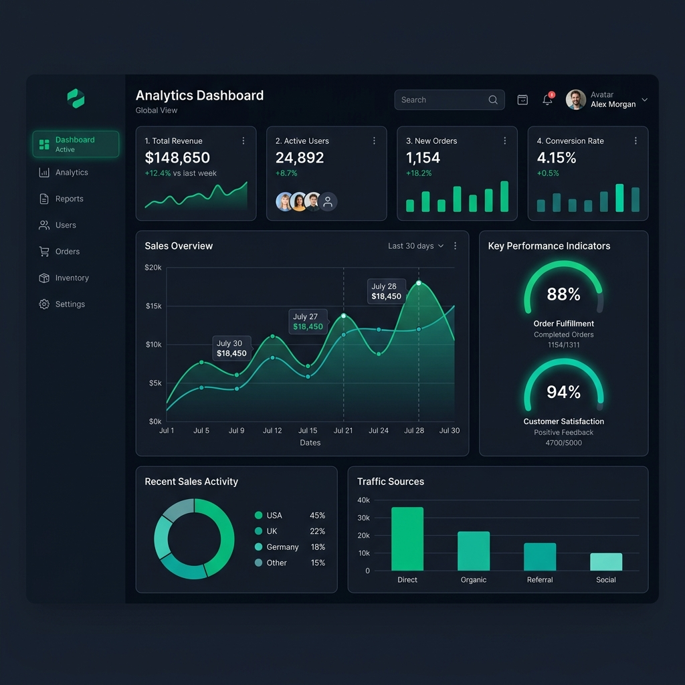

# DashPro Dashboard 📊

Hey there! 👋 This is DashPro, a dashboard template I built to learn React state management, responsive CSS grids, and interactive charting using Chart.js.

## 📸 Preview

## Why I built this
I always wanted to know how those clean, modern SaaS admin panels are built. I set out to make one that feels premium, uses a dark layout, and updates the data components dynamically. Working out the grid alignments and making sure charts resize properly on smaller screens was a huge learning curve!

## Features
- Real-time simulated statistics cards (Users, Revenue, Orders, Growth)
- Interactive charts and visual data representation using Chart.js
- Clean, modern dark theme interface with emerald and teal accents
- Responsive sidebar navigation layout

## Tech Stack
- **Frontend:** React, HTML5, CSS3, JavaScript (ES6+)
- **Charts:** Chart.js (with react-chartjs-2 wrapper)
- **Icons:** FontAwesome

## Known Issues (// TODOs)
- **Data Persistence:** Right now the analytics are loaded from local mock data. I need to hook this up to a real MongoDB database eventually to fetch live records.
- **Dark/Light Toggle:** I hardcoded the dark theme styles because they look so good, but adding a light mode toggle is definitely on the checklist.
- **Export Reports:** The "Download CSV" button on the UI is just a mockup for now.

## Setup Instructions

To get this running on your local machine:

1. Clone this repository
2. Navigate to `dashpro-frontend` and run `npm install`
3. Run `npm run dev` to start the local Vite development server
4. Open your browser and go to `http://localhost:5173`

Enjoy! 🚀
